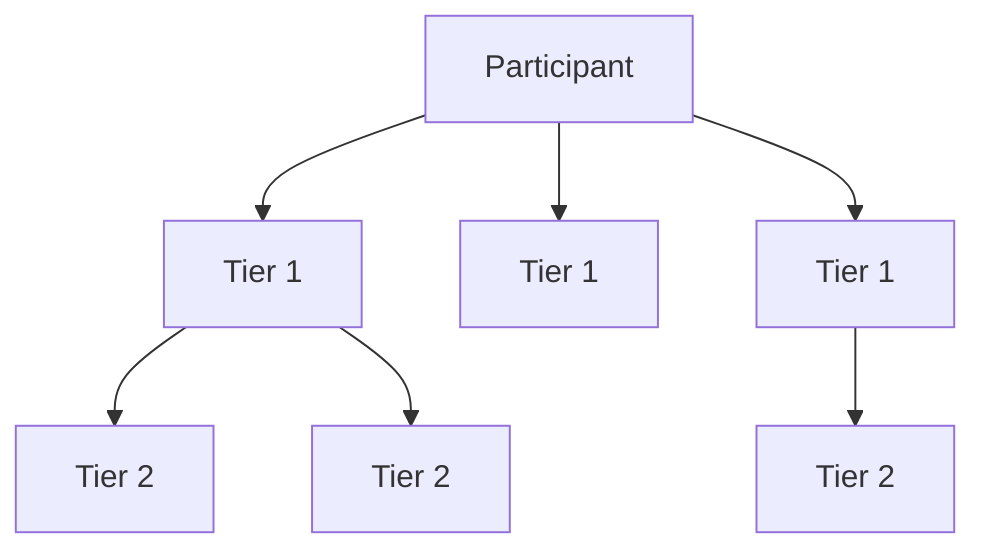

# Asset Chain Liquidity Mining Program

The **Asset Chain Liquidity Mining Program** is a strategic initiative aimed at deepening on-chain liquidity and rewarding participants for their engagement. Users earn points for performing various tasks within the Asset Chain ecosystem. These points will be redeemable at the end of the program for exclusive rewards.

This program incentivizes participation across decentralized finance (DeFi) activities, referral growth, and social engagement, all while contributing to the success of Asset Chain.

---

## 🚀 Gas Station

The **Asset Chain Gasoline Station** ensures users have enough gas fees (in **RWA tokens**) to perform basic on-chain operations.

> You can claim free gas to interact with dApps such as swapping, bridging, and liquidity provision on the Asset Chain Network.

---

## 🎯 What You Can Do

Participants can earn points by completing a variety of tasks:

### ✅ Blockchain Tasks
- Swap (trade) tokens on Asset Chain DEXs
- Bridge tokens from other chains
- Provide and lock liquidity

### ✅ Social Tasks
- Connect your X and Telegram accounts
- Complete verified social campaigns

### ✅ Referral Program
- Share your referral code to invite new users and earn bonuses

Points are awarded when task criteria are met and can be multiplied based on activity and community status.

---

## 🌉 Bridging

**Bridging** means transferring tokens from another blockchain to Asset Chain.

- Use the official bridge: [https://bridge.assetchain.org](https://bridge.assetchain.org)
- Or any supported ecosystem bridge

### 🧮 Bridging Points Formula

```text
Points = base × √(amount in USD)
```

- `base` is a predefined point multiplier
- `amount` is the USD value of the bridged token

> **Note:** Bridging points are initially marked as **locked**. They are **unlocked** only after:
> - The bridged token is used to **create a liquidity position**, and
> - The position is **locked for at least 30 days**

---

## 🔄 Swapping (Trading)

**Swapping** refers to trading one token for another within Asset Chain. Supported platforms include:

- Official DEX: [https://swap.assetchain.org](https://swap.assetchain.org)
- Other decentralized exchanges on Asset Chain

### 🧮 Swapping Points Formula

```text
Points = base × √(amount in USD)
```

Higher-value trades result in more points. Your trades only get points if the value of your trade is 5 USD or more.

---

## 🔒 Locking Liquidity Positions

Providing liquidity means depositing token pairs into liquidity pools. Locking that liquidity increases point rewards.

### 🧮 Locked Liquidity Points Formula

```text
Points = base × lock duration multiplier
```

- Longer lock durations yield higher multipliers
- Locked positions help stabilize the protocol and benefit the entire ecosystem

---

## 🧑‍🤝‍🧑 Referral Program

Invite others to Asset Chain and earn additional rewards!

### Referral Structure

| Tier | Description | Trading Fee Commission | Points Bonus |
|------|-------------|------------------------|---------------|
| Tier 1 | Your direct referrals | 5% | 20% |
| Tier 2 | Referrals of your Tier 1 users | 2% | — |

- Generate your referral code from the dashboard
- Share it with others to earn passive rewards from their activity



---

## 🌐 Communities

Participants who are members of recognized **Asset Chain communities** are eligible for **point multipliers** when they complete tasks.

> Being part of a community helps boost your score and encourages teamwork toward shared goals.

---

## 🏆 Leaderboard

Track your progress and see how you rank against other participants.

- The **leaderboard updates every 7 days** after weekly point distribution
- Top-ranking users may qualify for exclusive bonuses and recognition

---

## 📣 Social Tasks

Earn extra points by completing tasks on social platforms:

### Supported Actions
- Follow Asset Chain on **X (Twitter)**
- Join the **Telegram** group
- Retweet or share official campaign posts

### How to Participate
1. Connect your **X** and **Telegram** accounts via the dashboard
2. Complete social tasks and verify them to receive points

---

## 🎁 Conclusion

The **Asset Chain Liquidity Mining Program** empowers you to earn rewards while supporting the growth of the ecosystem.

Take advantage of every opportunity:
- Bridge tokens
- Provide and lock liquidity
- Trade actively
- Grow the community through referrals and social engagement

Start participating today and rise to the top of the leaderboard!

---

_Stay updated on announcements and opportunities through our official channels._
