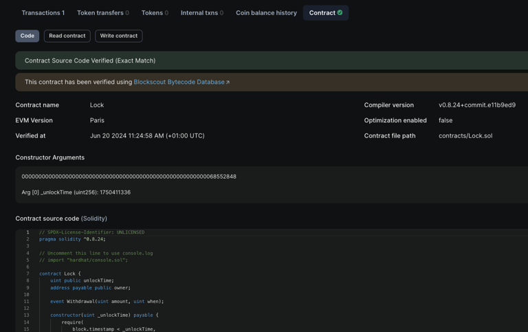

# 👀 Contract Verification

Pro tip: If you deployed your contract with Hardhat, use the Hardhat guide to verify it.

## With Advanced Explorer <a href="#with-advanced-explorer" id="with-advanced-explorer"></a>

**Get Started**

1. Visit the [Asset Chain Advanced Explorer](https://scan-testnet.assetchain.org/)​

<figure><figcaption></figcaption></figure>

2. On the Sidebar, hover on the \`Other\` link and click on \`verify contract\` link.

<figure><figcaption></figcaption></figure>

3. Clicking verify contract\` should open up a form similar to the one below. Proceed to enter the parameters with which you compiled your contract.

<figure><figcaption></figcaption></figure>

4. If you submitted the form successfully, your contract has been verified. Visiting the contract page, you should see a page similar to the one below; with an alert showing verified, and your contract code being displayed.

<figure><figcaption></figcaption></figure>

## With Hardhat

[Hardhat ](https://hardhat.org/)is a full-featured development environment for contract compilation, deployment and verification. The [Hardhat Etherscan plugin](https://hardhat.org/plugins/nomiclabs-hardhat-etherscan.html) supports contract verification on BlockScout.

#### Get Started <a href="#get-started" id="get-started"></a>

1. **Install Hardhat**

If you are starting from scratch, create an npm project by going to an empty folder, running `npm init`, and following the instructions. Recommend npm 7 or higher.

Once your project is ready:

**NPM instructions**

```bash
npm install --save-dev hardhat
```

**YARN instructions**

```bash
yarn add --dev hardhat
```


2. **Create a project**

Run `npx hardhat` in your project folder and follow the instructions to create ([more info here](https://hardhat.org/getting-started/#quick-start)).


3. Install plugin

Install the [hardhat-etherscan plugin](https://hardhat.org/plugins/nomiclabs-hardhat-etherscan.html) (requires **v3.0.0+).**

**npm**

```bash
npm install --save-dev @nomiclabs/hardhat-etherscan
```

**yarn**

```bash
yarn add --dev @nomiclabs/hardhat-etherscan
```

4. Add plugin reference to config file

Add the following statement to your `hardhat.config.js`.

```javascript
require("@nomiclabs/hardhat-etherscan");
```

If using TypeScript, add this to your `hardhat.config.ts.` [More info on using typescript with hardhat available here](https://hardhat.org/guides/typescript.html#typescript-support).

```javascript
import "@nomiclabs/hardhat-etherscan";
```

#### Config File <a href="#config-file" id="config-file"></a>

Your basic [Hardhat config file](https://hardhat.org/config/) (`hardhat.config.js` or `hardhat.config.ts`) will be setup to support the network you are working on. In this example we use the Asset Chain test network and a `.js` file.

Asset Chain is not directly supported by the plugin (to check run `npx hardhat verify --list-networks`)

But we can add it in a `customChains` object, to the config file. It includes:

* `chainID` - 42421
* `apiURL` - "http://scan-testnet.assetchain.org/api"
* `browserURL` - "http://scan-testnet.assetchain.org"


The network name in `customChains` must match the network name in the `apiKey` object.


```json
require("@nomiclabs/hardhat-waffle");
require("@nomiclabs/hardhat-etherscan");
require('hardhat-deploy');

let secret = require("./secret");

module.exports = {
  solidity: "0.8.9",
  networks: {
    localhost: {
      url: "http://127.0.0.1:8545/",
      accounts: [secret.key],
    }
  },
  etherscan: {
    apiKey: {
      assetchain_test: "abc"
    },
    customChains: [
      {
        network: "assetchain_test",
        chainId: 42421,
        urls: {
          apiURL: "https://scan-testnet.assetchain.org/api",
          browserURL: "https://scan-testnet.assetchain.org/"
        }
      }
    ]
  }
};
```

#### Deploy and Verify <a href="#deploy-and-verify" id="deploy-and-verify"></a>

#### Deploy <a href="#deploy" id="deploy"></a>

```bash
D:\hard_hat> npx hardhat run scripts\deploy.js --network assetchain_test
Contract deployed to: 0x8595e22825Ba499dB8C77C5c830c235D80f9C0fa
```

#### Verify <a href="#verify" id="verify"></a>

You can include constructor arguments with the verify task.

<pre class="language-bash"><code class="lang-bash"><strong>npx hardhat verify --network &#x3C;network> DEPLOYED_CONTRACT_ADDRESS "Constructor argument 1"
</strong></code></pre>


For info on more complex constructor arguments(arrays, tuples..) please [visit here](https://hardhat.org/hardhat-runner/plugins/nomicfoundation-hardhat-verify#complex-arguments).


Example (no constructors).

```sh
D:\hard_hat>npx hardhat verify --network assetchain_test 0x263E6d3E8b98fB0393A108825E2DcE3063F66713  --constructor-args ./scripts/arguments.js 
[INFO] Sourcify Verification Skipped: Sourcify verification is currently disabled. To enable it, add the following entry to your Hardhat configuration:

sourcify: {
  enabled: true
}

Or set 'enabled' to false to hide this message.

For more information, visit https://hardhat.org/hardhat-runner/plugins/nomicfoundation-hardhat-verify#verifying-on-sourcify
Successfully submitted source code for contract
contracts/MultiSigWallet.sol:MultiSigWallet at 0x263E6d3E8b98fB0393A108825E2DcE3063F66713
for verification on the block explorer. Waiting for verification result...

Successfully verified contract MultiSigWallet on the block explorer.
http://scan-testnet.assetchain.org/address/0x263E6d3E8b98fB0393A108825E2DcE3063F66713#code
```

#### Confirm Verification on BlockScout <a href="#confirm-verification-on-blockscout" id="confirm-verification-on-blockscout"></a>

Go to our BlockScout Explorer and paste the contract address into the search bar.

<figure><figcaption></figcaption></figure>

Scroll down to see verified status. A green checkmark ✅ means the contract is verified.

<figure><figcaption></figcaption></figure>

You can now scroll down in the explorer to see and interact with the contract code.


Congratulations! Your contract is successfully verified on Asset Chain Explorer.


### &#x20;<a href="#faq" id="faq"></a>
